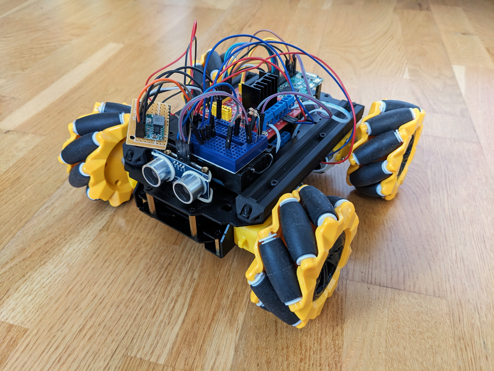

# Mecanum car
This is the software I use to control my mecanum-wheeled robot (shown below).

It's a project I undertook during the 2023 summer holidays to get started with Rust, physical computing and Web developement (and of course to have some fun).

## Hardware overview
The robot consists of:
* a chassis with mecanum wheels and 4 TT motors
* two L298N modules to control the motors
* a Raspberry Pi Zero W - the brain of the robot
* two 18650 rechargable batteries to power everything
* a small power regulator to provide required voltage to the Raspberry Pi
* an HC-SR04 ultrasonic distance sensor

## Software overview
To control the robot, I connect it to my computer via WebSocket and my home WiFi network, and use the served HTML page to send commands to the backend software. The backend software is written in Rust. It uses the `Actix Web` framework to manage the WebSocket connection and the `rppal` library to control the Raspberry Pi peripherals. 

### Features
As for the end of the 2023 summer holidays, I have implemented the following features:

#### Manual motion control
The robot can serve as a simple RC car, using the provided 11-button panel, which allows many different types of motion (taking advantage of the mecanum wheels). There is also a `Speed` slider below the panel, which allows me to control the speed of the robot, and displays the approximate speed with which the robot should be moving (based on performed calibration).

#### Distance measurement
The `Measure Distance` button allows me to measure the current distance to the nearest obstacle, as seen by the HC-SR04 sensor.

#### Movement calibration
Allowed me to measure how fast my robot is going when a certain PWM duty cycle is applied to the L298N enable pins. During the calibration, the robot is moving back and forth with different duty cycle values, while constantly performing distance measurements. It then saves the measurements to different files, which allows me to analyze the data.

#### Move forward 0.5 m, Rotate 360 deg
Using the movement calibration data, I can now move the robot a specified distance or rotate it a specified angle. However, due to the inaccuracy of the measurements and the fact that the battery voltage drops constantly, I had to introduce a `Slip` slider, which indicated how much longer the robot should spin to complete the full rotation.

#### Scan distance
Should rotate the robot 360 deg and measure distance throughout the rotation (similar to a LIDAR sensor) - this feature doesn't work however, due to an annoying distance sensor bug.

### The annoying distance sensor bug
The distance sensor tends to behave a little unpredictably - sometimes it seems to work. Then it locks and constantly displays a distance around 1 cm. After some random modification in the code, it seems to work again, and then it performs an unsuccessful measurement and freezes the whole program. I have some theories as to why some of that might happen, but am mostly helpless when it comes to fixing the bug. It is therefore very annoying and stalls my development.

### Future improvements
I have some ideas for additional features when I have some time to implement them (and when I have fixed the distance sensor bug), including:
* Self driving - drives until it encounters an obstacle, then looks around and proceeds in the direction where there is more space
* Line following
* Enabling more advanced movements using the motion calibration data
* Mapping a room with LIDAR-like distance scanning
* Adding a camera

For now, hovewer, I don't think I will have much time to improve the project as the academic year is starting.
